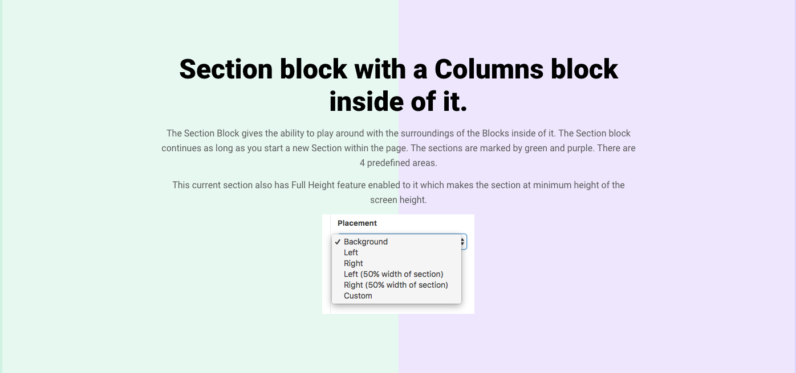

# Section Block

A section block example for Everblox. [See this block in action!](http://swiss.evermade.fi/)

## Screenshot

## Tested

This block has been tested on the following browsers:

- [x] Chrome
- [ ] Firefox
- [ ] Safari
- [ ] IE 11

## Installation

This block will seamlessly integrate with the [Dockerpress](https://bitbucket.org/evermade/dockerpress) build, with Gulp automatically copying and watching the PHP, SCSS and JS.

* `em everblox add section my-new-block` will clone the `section` block to a new block called `my-new-block`

### Manual Installation

* Clone this repository into `lib/blocks/page` of your [Swiss theme](https://bitbucket.org/evermade/swiss) and rerun `Gulp`
* Remove the `.git` folder so this becomes part of your project

## Usage

* The `init.php` is called during the WP init action, so we can register our ACF layout, and any bespoke block stuff such as enqueuing assets
* The `render.php` is the file that is called upon the every use of this block on a page
* The `/templates/view.php` is what `render.php` uses to output the HTML

## Adding/editing blocks fields

* The [ACF layout](https://www.advancedcustomfields.com/resources/flexible-content/) code can be found in `includes/acf.php`
* See [Register fields via PHP](https://www.advancedcustomfields.com/resources/register-fields-via-php/) for more

## Folder Structure

* `includes/` contains the PHP libraries and functions for this block, all namespaced to avoid conflicts
* `js/` contains the required Javascript
* `scss/` contains the required the CSS
* `templates/` contains any HTML views you wish to render, try to keep logic away from these!

## Dependencies

What does this block depend on to be used.

### PHP

* None

### CSS

* `swiss/assets/scss/everblox-helper.scss` for mixins and variables

### JS

* `swiss/assets/js/components/animations.js`

## Notes

* [View all available blocks in Bitbucket](https://bitbucket.org/account/user/evermade/projects/EVERBLOX)

## Contributors

Paul Stewart

[See an issue, have an awesome suggestion, or just have a bug fix? Please report it.](https://bitbucket.org/evermade/section-block/issues/new)
